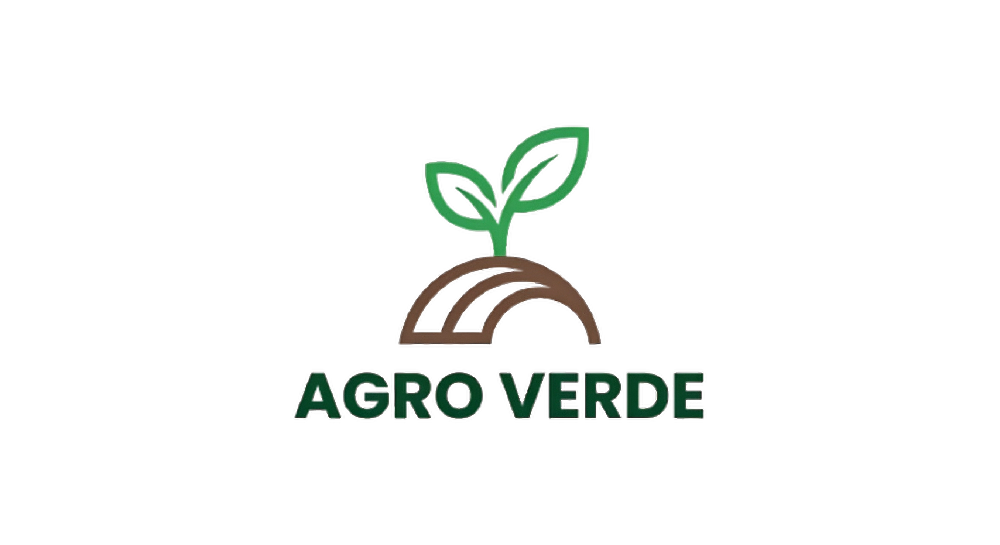

# AgroVerde

Sistema para la gestión de terrenos, cultivos, sanidad vegetal e inventario agrícola del Centro Agropecuario del SENA.

Agro Verde es una aplicación móvil que sirve para llevar el control de los terrenos, seguir las etapas de crecimiento de las siembras, manejar los insumos agrícolas y registrar el tiempo de trabajo en campo.

## Características principales

- Gestión de terrenos y parcelas: registro de los espacios de siembra.
- Seguimiento fenológico: control de las etapas de desarrollo de los cultivos.
- Inventario de insumos: control de agroquímicos y herramientas.
- Control de tiempos: registro de las labores y las horas de práctica de los aprendices.
- Despliegue: puede funcionar en la nube (SaaS) o en servidores locales (On-Premise).

## Módulos desarrollados

Estos módulos ya están hechos en HTML y CSS. Cada uno tiene su carpeta en `pages` y su carpeta de estilos en `assets/css`.

### Inicio de sesión

- Iniciar sesión (`iniciar-sesion.html`)
- Crear cuenta (`crear-cuenta.html`)
- Recuperar contraseña (`recuperar-contrasena.html`)
- Acceso de usuario (`acceso-usuario.html`)
- Crear propiedad (`crear-propiedad.html`)
- Notificaciones por correo (`notificaciones-por-correo.html`)

### Inicio

- Pantalla de inicio (`inicio.html`)
- Configuración (`configuracion.html`)
- Historial (`historial.html`)
- Perfil (`perfil.html`)

### Cultivos

- Lista de cultivos (`cultivos.html`)
- Crear cultivo (`crear-cultivo.html`)
- Ver cultivo (`ver-cultivo.html`)
- Comparar cultivos (`comparar-cultivo.html`)
- Fase fenológica (`fase-fenologica.html`)
- Día de cosecha (`dia-cosecha.html`)

### Plagas

- Catálogo de plagas (`catalogo-plagas.html`)
- Gestión de plagas (`gestion-plagas.html`)
- Pantalla principal de plagas (`plagas.html`)

### Propiedad

- Crear propiedad (`crear-propiedad.html`)
- Ver propiedad (`ver-propiedad.html`)
- Ver etapa (`ver-etapa.html`)
- Inhabilitar propiedad (`inhabilitar-propiedad.html`)

### Terreno

- Lista de terrenos (`terreno.html`)
- Nuevo terreno (`nuevo-terreno.html`)
- Historial de terrenos (`historial-terrenos.html`)

## modulos faltantes 
- clima 
- histotial 
- insumos 
- perfil
- reportes

## Tecnologías usadas

- HTML
- CSS
- Bootstrap
- Git y GitHub

## Equipo de desarrollo: ByteRaíz

- July Daniela Riaño Soto
- Helian Camilo Moreno Latorre
- Dayan Leonel Montañez Combita
- Derlin Yissel Caro Bautista
